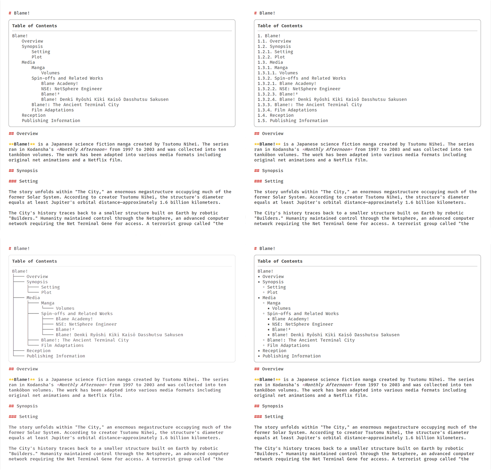

# Markdown Table of Contents

A Sublime Text plugin that shows a Table of Contents for Markdown files with clickable entries.

## Installation
Clone the repository under your Packages directory (`~/Library/Application Support/Sublime Text/Packages`, `%APPDATA%\Sublime Text\Packages` or `~/.config/sublime-text/Packages`).  
(The plugin files should be located in `Packages/mdtoc` directory)

## Usage
Press `Ctrl+Shift+M` to toggle the Table of Contents or use "Markdown Table of Contents: toggle" Command Palette entry.

### Settings
See the [default settings file](mdtoc.sublime-settings) for available settings and descriptions.

## Changelog
### 1.2.0
- Significantly reduce excessive redraws

### 1.1.0
- Add Table of Contents indentation styles
- Add dependencies.json

### 1.0.0
Initial release

## License
This project is licensed under the [WTFPL License](http://www.wtfpl.net/):
> Copyright © 2016 Xiangrong Hao
>
> Everyone is permitted to copy and distribute verbatim or modified  copies of this license document, and changing it is allowed as long as the name is changed.
>
> DO WHAT THE FUCK YOU WANT TO PUBLIC LICENSE  
> TERMS AND CONDITIONS FOR COPYING, DISTRIBUTION AND MODIFICATION  
>
> 0. You just DO WHAT THE FUCK YOU WANT TO.
